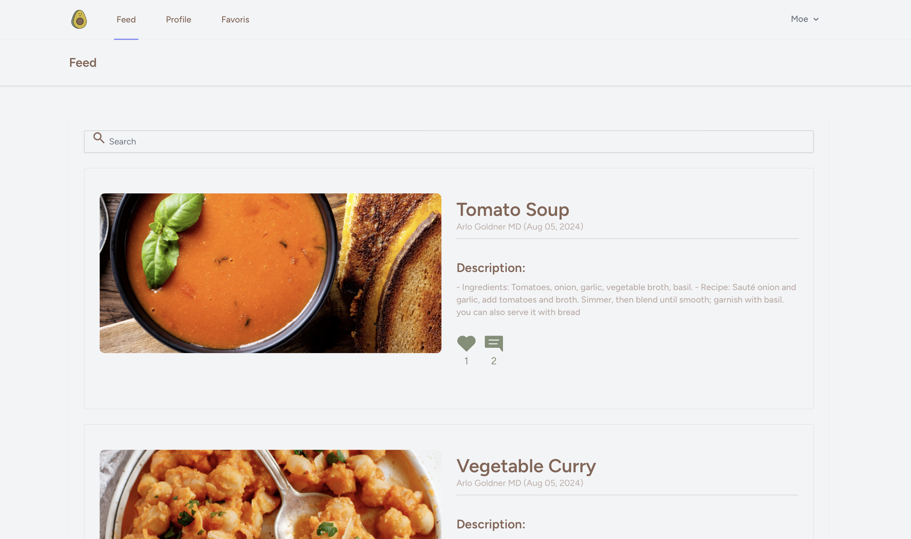
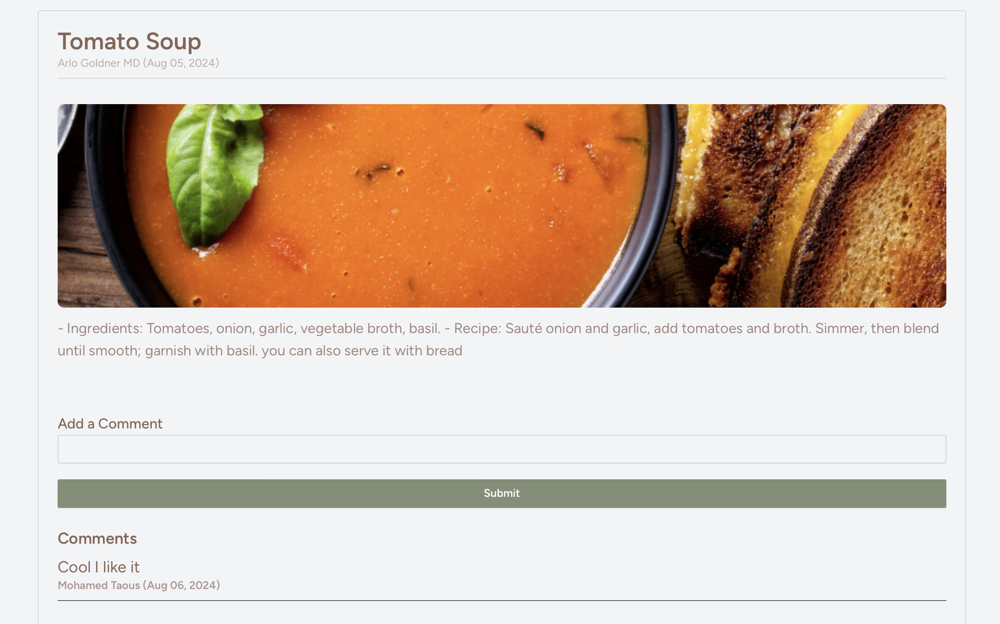
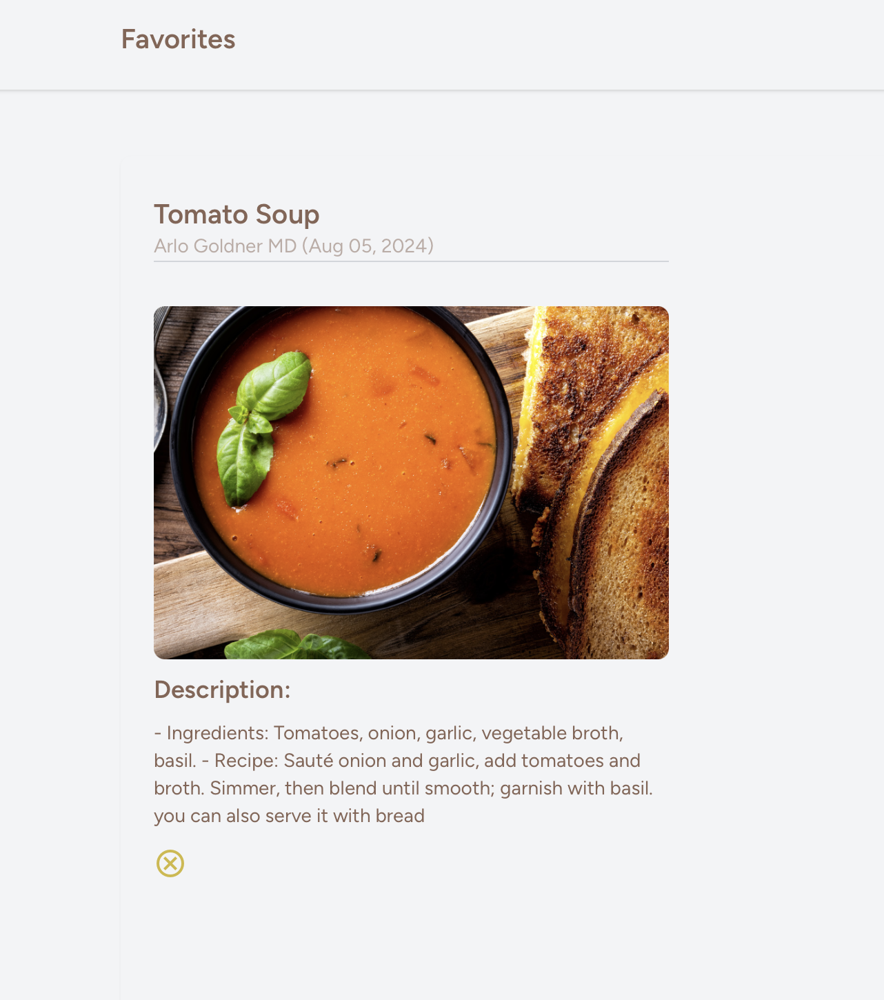
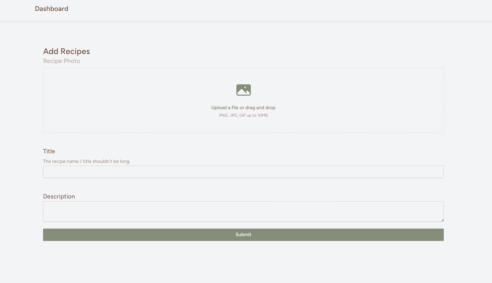

# Repas Simple

## **Description**
Repas Simple is a dynamic recipe-sharing platform built with Laravel and Livewire, enabling real-time CRUD operations without page refreshes. This community-driven platform allows food lovers to share and discover recipes through an interactive and responsive interface.

## **Tech Stack**
- Laravel - PHP Framework
- Livewire - Full-stack framework for dynamic Laravel applications
- MySQL - Database
- Tailwind CSS - Styling
- Alpine.js - JavaScript framework

## **Features**
- **User Authentication**
  - Sign up and login functionality
  - Secure user sessions

- **Recipe Management (CRUD)**
  - Create and share new recipes
  - Read and browse recipes from other users
  - Update your own recipes
  - Delete recipes you've created

- **Interactive Features**
  - Real-time commenting system
  - Like/unlike recipes
  - Save recipes to favorites
  - Search functionality for recipes

## **Screenshots**

### Home Feed
Browse through a variety of recipes in the main feed with real-time search capabilities.



### Comments
Engage with the community through real-time comments on recipes.



### Favorites
Save your favorite recipes for quick access later.



### Recipe Management
Easily add, edit, or remove your recipes through an intuitive interface.



## **Setup Instructions**

### Prerequisites
- PHP >= 8.1
- Composer
- Node.js & NPM
- MySQL

### Installation Steps
1. Clone the repository
   ```bash
   git clone https://github.com/yourusername/repas-simple.git
   cd repas-simple
   ```

2. Install PHP dependencies
   ```bash
   composer install
   ```

3. Install NPM dependencies
   ```bash
   npm install
   ```

4. Create environment file
   ```bash
   cp .env.example .env
   ```

5. Generate application key
   ```bash
   php artisan key:generate
   ```

6. Configure your database in `.env` file
   ```
   DB_CONNECTION=mysql
   DB_HOST=127.0.0.1
   DB_PORT=3306
   DB_DATABASE=your_database_name
   DB_USERNAME=your_username
   DB_PASSWORD=your_password
   ```

7. Run database migrations
   ```bash
   php artisan migrate
   ```

8. Start the development server
   ```bash
   php artisan serve
   ```

9. In a separate terminal, compile assets
   ```bash
   npm run dev
   ```

Visit `http://localhost:8000` to access the application.

## **Contributing**
1. Fork the repository
2. Create your feature branch (`git checkout -b feature/AmazingFeature`)
3. Commit your changes (`git commit -m 'Add some AmazingFeature'`)
4. Push to the branch (`git push origin feature/AmazingFeature`)
5. Open a Pull Request

## **License**
This project is licensed under the MIT License - see the LICENSE file for details.

